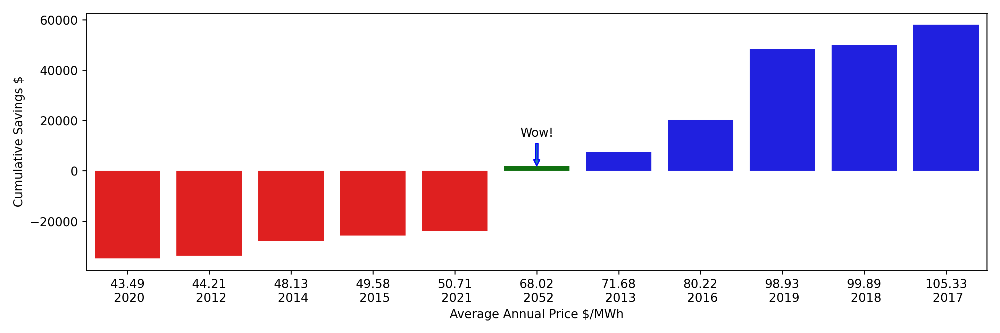

# Typical Year Forecasting of Electricity Prices

Supporting code for the blog post [Typical Year Forecasting of Electricity Prices](https://adgefficiency.com/typical-year-forecasting-electricity-prices/).


<p align="center"><em>Comparison of the typical year forecast (2052) versus historical prices.</em></p>

## Use

Data for the analysis is included as a single Parquet file in `./data/trading-price.parquet`.

You can reproduce the analysis by running the `make` command below (you will need Python 3.10 or above):

```shell
$ make
```

This will install Python dependencies with Poetry and run three Python scripts, which creates figures, tables and a typical year forecast as a Parquet file `./data/tmy-forecast.parquet`.
